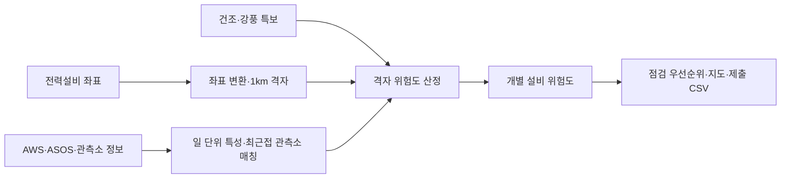

# FIRE-GUARD 3.0

**기상·공간 데이터를 결합해 전력설비 주변의 화재 위험을 분석하고 예방점검 우선순위를 제시하는 프로젝트입니다.**

Python · Pandas · Geo-processing · PyProj · Folium · 규칙 기반 위험도 분석

## 이봉헌의 기여

기상·공간 데이터 분석 프로젝트 · 이봉헌의 구현 범위.

| 담당 작업 | 코드 변경 |
|---|---|
| 격자별 최근접 기상 관측소 매칭 | [변경 내용](https://github.com/kara320090/fire-guard/commit/c4780d443039ddf3d11312ea45ba655666de035a) |
| 규칙 기반 격자 위험도와 설비별 점검 후보 산출 | [변경 내용](https://github.com/kara320090/fire-guard/commit/d313636403d42fc2869cfc7fa3100b0a5fb2bdf2) |
| 설비 위험도 결과와 지도 출력 연결 | [변경 내용](https://github.com/kara320090/fire-guard/commit/a9efdf8b0c28a2e3f573c87d6dbef258668933b3) |

## 문제와 접근

기상 위험만으로는 어느 설비부터 점검할지 결정하기 어렵습니다. 전력설비 좌표를 1km 격자로 묶고, 가까운 AWS/ASOS 관측소의 기상 정보와 건조·강풍 특보를 결합해 격자와 개별 설비의 점검 우선순위를 계산합니다.

현재 저장소의 결과는 **설명 가능한 규칙 기반 baseline**입니다. 학습된 화재 예측 모델의 정확도나 실제 사고 예방 효과를 측정한 결과와는 구분합니다.

## 분석 흐름



## 결과물

격자·전력설비별 위험도, 점검 후보 CSV와 지도를 생성합니다. [분석 요약](reports/FIRE_GUARD_final_summary.md)에서 산출물의 구성과 입력 자료를 확인할 수 있습니다.

## 핵심 코드

| 단계 | 파일 |
|---|---|
| 좌표·격자 생성 | [03_build_grid_1km.py](src/03_build_grid_1km.py) |
| 관측소 매칭 | [14_match_grid_station.py](src/14_match_grid_station.py) |
| 일별 특성 구성 | [15_make_grid_day_features.py](src/15_make_grid_day_features.py) |
| 격자 위험도 | [18_make_grid_risk_scores.py](src/18_make_grid_risk_scores.py) |
| 설비별 후보 | [19_make_pole_risk_and_submissions.py](src/19_make_pole_risk_and_submissions.py) |
| 지도 생성 | [21_make_risk_maps.py](src/21_make_risk_maps.py) |
| 제출 파일 검수 | [23_finalize_submission_package.py](src/23_finalize_submission_package.py) |

## 재현 방법

```powershell
python -m venv .venv
.\.venv\Scripts\Activate.ps1
python -m pip install -r requirements.txt
python src/00_check_project.py
```

원자료와 중간 산출물은 [데이터 목록](reports/data_inventory.md), [현재 파이프라인 상태](PROJECT_STATUS.md)를 기준으로 준비합니다. 대용량·원천 데이터가 모두 GitHub에 포함된 것은 아니므로 구조 점검에서 누락 경로를 먼저 확인합니다. 기존 분석 파일명은 주로 `202503` 기간을 사용합니다.

필요한 중간 데이터가 준비된 환경에서는 저장소 루트에서 다음 후반 파이프라인을 실행합니다.

```powershell
python src/18_make_grid_risk_scores.py
python src/19_make_pole_risk_and_submissions.py
python src/21_make_risk_maps.py
python src/23_finalize_submission_package.py
```

## 자료와 후속 과제

- [최종 산출물 명세](submission/submission_manifest.md)
- [위험도 분석 보고서](reports/grid_risk_scores_report.md)
- [최종 구조 검수](reports/final_submission_check_report.md)
- 실제 화재 라벨 확보 후 지도학습·임계값 검증
- 지형·산림·토지피복·현장 접근성 정보 보강
- 계절·기간을 확장한 결과 비교

ASOS/AWS 관측과 관측소 메타데이터·특보는 특성 생성, 공간 매칭과 분석에 사용합니다. 데이터 출처와 활용 범위는 프로젝트 보고서에서 관리합니다.
