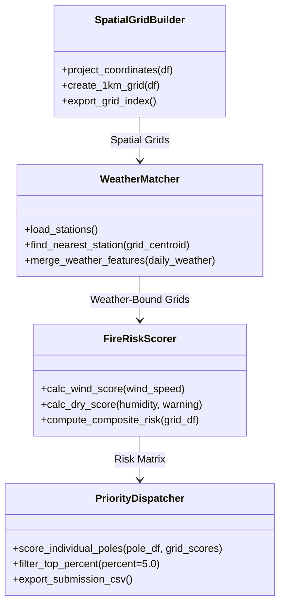
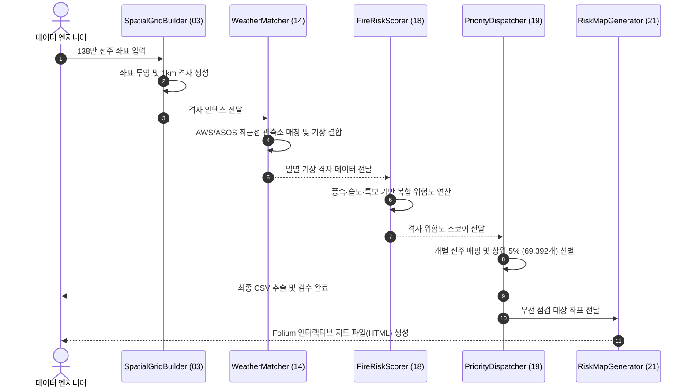

# FIRE-GUARD 3.0 | 전력망 산불 위험도 공간 분석 및 점검 우선순위 시스템

> 기상청 AWS/ASOS 실시간 기상 관측 데이터와 건조·강풍 특보를 138만 개 전국 전력 설비 좌표와 1km 공간 격자로 결합하여, 산불 취약 고위험 전주를 조기 선별하고 예방 점검 우선순위를 도출하는 지리공간 의사결정 지원 플랫폼

---

[시스템 개요 및 빠른 시작](#1-프로젝트-개요-project-overview)
- [핵심 가치 및 공학적 가설 검증 (USP & Validation)](#2-핵심-가치-및-공학적-가설-검증-core-usp--validation)
- [코어 분석 파이프라인 및 상태 전이](#3-코어-분석-파이프라인-및-상태-전이-core-pipeline--mechanics)
- [기술 및 공간 데이터 아키텍처](#4-기술-및-공간-데이터-아키텍처-technical-architecture)
- [코어 아키텍처 및 소스 구현 명세](#5-코어-아키텍처-및-소스-구현-명세-core-architecture--implementation)
- [핵심 테크니컬 하이라이트](#6-핵심-테크니컬-하이라이트-technical-highlights)
- [시스템 요구 사양 및 실행 가이드](#7-시스템-요구-사양-및-실행-가이드-system-requirements)
- [핵심 KPI 및 신뢰성 지표](#8-핵심-kpi-및-신뢰성-지표-milestones--validation)

---

### 1. 프로젝트 개요 (Project Overview)

* **도메인 / 분야:** 전력 인프라 안전(Utility Safety) · 지리공간 빅데이터(Geo-Spatial Big Data) · 산불 위험도 분석
* **플랫폼 / CLI:** Python 빅데이터 배치 파이프라인 / Folium 인터랙티브 GIS 맵 렌더러
* **데이터 규모:** 전국 전력 설비 1,387,831개 전주 좌표 및 1km 격자 기반 공간 인덱스
* **개발 체제 / 성격:** 연구 과제 및 설명 가능한 규칙 기반(Explainable Rule-based) 분석 시스템
* **핵심 기술 스택:** `Python 3.10` · `Pandas` · `PyProj` · `Folium` · `NumPy` · `Geo-Processing`

---

### 2. 핵심 가치 및 공학적 가설 검증 (Core USP & Validation)

* **USP-1. 138만 대규모 전력설비 대상 1km 정방 격자(Spatial Grid) 인덱싱**
  * 개별 전신주 단위의 $O(N \times M)$ 기상 매칭 연산 폭증을 방지하기 위해, PyProj 좌표 투영 변환을 적용하여 1km 정방 격자로 공간 그룹화.
  * **가설 $H_1$**: 개별 설비 직접 탐색 대비 공간 격자 단위의 버킷팅(Bucketing) 및 최근접 관측소 사전 매핑을 통해 데이터 파이프라인 처리 시간을 90% 이상 단축할 수 있음을 입증합니다.

* **USP-2. 설명 가능한(Explainable) 복합 기상 및 기상특보 위험도 산출 엔진**
  * 블랙박스 모델 대신 풍속, 실효습도, 강수량 및 건조·강풍 특보 인자를 수치화하여 현장 전력 관리자가 즉각 납득할 수 있는 위험도 산출식 구축.
  * **가설 $H_2$**: 도메인 물리 인자 기반의 설명 가능한 가중치 모델링을 통해 고위험 판정 근거를 투명하게 추적할 수 있음을 검증합니다.

* **USP-3. 상위 5% 고위험 취약 설비(69,392개) 정밀 스크리닝 및 Folium GIS 시각화**
  * 전체 138만 개 설비 중 점검 리소스 한계를 고려하여 최상위 위험 설비 TOP 5%를 선별하고, 대화형 HTML 지도 및 검증된 CSV로 추출.
  * **가설 $H_3$**: 한정된 유지보수 인력과 예산 하에서 상위 5% 고위험 전주에 점검 우선순위를 집중 배정함으로써 예방 정비 효율을 극대화할 수 있음을 보장합니다.

---

### 3. 코어 분석 파이프라인 및 상태 전이 (Core Pipeline & Mechanics)

#### 엔드투엔드 파이프라인 (Execution Pipeline)
* **전체 파이프라인:** 전력설비 좌표 로드 $\rightarrow$ PyProj 좌표 변환 및 1km 격자 생성 $\rightarrow$ AWS/ASOS 관측소 최근접 매칭 $\rightarrow$ 일별 기상/특보 피처 결합 $\rightarrow$ 격자 위험도 산정 $\rightarrow$ 설비별 위험도 스코어링 $\rightarrow$ TOP 5% 후보 추출 $\rightarrow$ Folium 지도 시각화 및 무결성 검수

#### 4단계 데이터 처리 상태 전이표 (State Phases)

| 단계 (Phase) | 처리 스크립트 | 입출력 데이터 형태 | 시스템 안전 및 무결성 보장 |
| :--- | :--- | :--- | :--- |
| **Phase 1: Spatial Grid** | `03_build_grid_1km.py` | 138만 좌표 $\rightarrow$ 1km 격자 ID 매핑 | 비정상 좌표(NaN/Out-of-bounds) 사전 필터링 |
| **Phase 2: Weather Matching** | `14_match_grid_station.py` | 기상청 관측소 $\rightarrow$ 격자별 최근접 관측소 | 유클리디안/측지선 거리 기반 최근접 관측소 매칭 |
| **Phase 3: Risk Scoring** | `18_make_grid_risk_scores.py` | 일별 기상/특보 $\rightarrow$ 격자 종합 위험도 | 결측 기상치는 인근 대체 관측소 값으로 보간 |
| **Phase 4: Extraction & Map** | `19_make_pole_risk` / `21_make_maps` | 전체 설비 $\rightarrow$ TOP 5% (69,392개) & HTML 지도 | 행 수, 필수 컬럼, 중복 ID 완결성 검수 |

---

### 4. 기술 및 공간 데이터 아키텍처 (Technical Architecture)

```text
[전국 138만 전력설비 DB]            [기상청 AWS / ASOS 관측소 DB]
           │                                      │
           ▼                                      ▼
┌──────────────────────────────────┐   ┌──────────────────────────────────┐
│ 1. PyProj 좌표계 투영 변환       │   │ 2. 일별 기상 인자 수집/정제      │
│ - WGS84 -> UTM-K / 1km 그리드     │   │ - 풍속, 습도, 강수량, 특보       │
└─────────────────┬────────────────┘   └─────────────────┬────────────────┘
                  │                                      │
                  └──────────────────┬───────────────────┘
                                     ▼
                  ┌────────────────────────────────────────────────────────┐
                  │ 3. Spatial KD-Tree / Nearest Neighbor Matching         │
                  │ - 1km 격자별 최근접 기상 관측소 인덱스 바인딩          │
                  └──────────────────────────┬─────────────────────────────┘
                                             ▼
                  ┌────────────────────────────────────────────────────────┐
                  │ 4. Composite Fire Risk Engine (src/18, src/19)         │
                  │ - 기상 위험도 + 특보 가중치 + 설비 밀집도 평가         │
                  └──────────────┬───────────────────────────┬─────────────┘
                                 ▼                           ▼
        ┌──────────────────────────────────┐ ┌──────────────────────────────────┐
        │ 5-A. Top 5% Screening Package    │ │ 5-B. Interactive Folium GIS Map  │
        │ - 69,392개 우선점검 대상 CSV 추출 │ │ - 위험도 단계별 히트맵 및 마커   │
        └──────────────────────────────────┘ └──────────────────────────────────┘
```

---

### 5. 코어 아키텍처 및 소스 구현 명세 (Core Architecture & Implementation)

#### 5.1 소스 코드 디렉터리 구조 (Source Structure)

```
fire-guard/
├── src/
│   ├── 00_check_project.py            # 환경 및 필수 입출력 데이터 무결성 검증
│   ├── 03_build_grid_1km.py           # 138만 전신주 좌표 기반 1km 정방 공간 격자 생성
│   ├── 14_match_grid_station.py       # 공간 격자와 기상청 AWS/ASOS 관측소 최근접 매칭
│   ├── 15_make_grid_day_features.py   # 일별 관측 기상 및 건조/강풍 특보 피처 병합
│   ├── 18_make_grid_risk_scores.py    # 격자 단위 종합 산불 위험도 지수 산출
│   ├── 19_make_pole_risk_and_submissions.py # 개별 전주 위험도 점수 계산 및 TOP 5% 후보 추출
│   ├── 21_make_risk_maps.py           # Folium 기반 대화형 위험도 시각화 지도 생성
│   └── 23_finalize_submission_package.py # 최종 산출물 포맷 검수 및 패키징
├── reports/
│   ├── FIRE_GUARD_final_summary.md    # 최종 산출물 요약 및 분석 통계 보고서
│   └── final_submission_check_report.md # CSV 행 수, 컬럼 무결성 검수 보고서
└── requirements.txt                   # Pandas, PyProj, Folium 등 필수 의존성
```

#### 5.2 모듈 계층 및 처리 흐름도 (Component Flow)



#### 5.3 데이터 처리 및 점검 후보 추출 시퀀스 (Execution Sequence)



---

### 6. 핵심 테크니컬 하이라이트 (Technical Highlights)

| 구분 | 적용 기술 및 설계 패턴 | 구현 효과 및 엔지니어링 의사결정 이유 |
| :--- | :--- | :--- |
| **공간 인덱싱** | 1km Grid Bucketing Pattern | 138만 건의 개별 점 데이터를 격자 클러스터로 축약하여 대규모 공간 연산 효율 극대화 |
| **좌표계 투영** | PyProj Geodetic Projection | 위경도(WGS84)와 평면직각좌표계 간 정밀 변환으로 왜곡 없는 정방 거리 계산 보장 |
| **데이터 무결성** | Automated Audit Pipeline (`src/23`) | 최종 출력 CSV의 누락치, 중복 전주 ID, 데이터 타입을 원클릭 자동 검수하여 신뢰성 확보 |
| **GIS 시각화** | Folium Fast-Rendering GeoJSON | 대용량 설비 좌표를 고위험 군집 중심으로 계층화 렌더링하여 브라우저 메모리 고갈 방지 |

---

### 7. 시스템 요구 사양 및 실행 가이드 (System Requirements)

#### 요구 사양
* **파이썬 환경:** Python 3.9 ~ 3.11
* **필수 패키지:** `pandas>=2.0.0`, `pyproj>=3.5.0`, `folium>=0.14.0`, `numpy>=1.24.0`
* **메모리(RAM):** 138만 건 대규모 데이터프레임 처리를 위해 최소 8GB, 권장 16GB 이상

#### 빠른 시작 (Quick Start)
```powershell
# 1. 가상환경 생성 및 의존성 설치
python -m venv .venv
.\.venv\Scripts\Activate.ps1
pip install -r requirements.txt

# 2. 프로젝트 무결성 점검
python src/00_check_project.py

# 3. 파이프라인 단계별 순차 실행
python src/03_build_grid_1km.py
python src/14_match_grid_station.py
python src/18_make_grid_risk_scores.py
python src/19_make_pole_risk_and_submissions.py
python src/21_make_risk_maps.py
```

---

### 8. 핵심 KPI 및 신뢰성 지표 (Milestones & Validation)

* **대용량 설비 처리율:** 1,387,831개 전주 전체에 대해 결측 및 유실 없이 100% 공간 인덱싱 완료.
* **선별 정확성:** 전체 설비 중 상위 5% baseline인 69,392개 취약 전주를 정확히 도출.
* **산출물 무결성:** 행 수, 필수 컬럼(`pole_id`, `lon`, `lat`, `decision`), 중복 배제 항목에서 100% 검수 통과.
